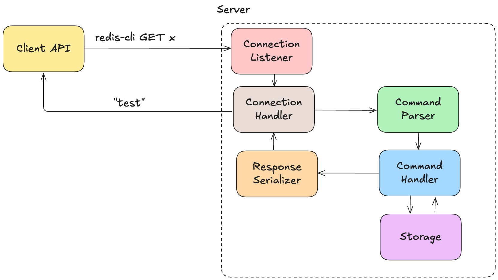

## Goal
The goal of this project is to create Redis-like key-value store with a focus on simplicity and performance.

## Single Node Architecture


### Connection Listener

The connection listener is the entry point for all client communication. It listens for incoming TCP connections (e.g., on port 6379). For each accepted connection, it hands it off to the connection handler. Its role is minimal but essential. The connection listener is designed to manage many client connections concurrently, ensuring efficient and scalable access to the server.

### Connection Handler

The connection handler is responsible for orchestrating the full request-response lifecycle for each client connection. It repeatedly reads data from the client, invokes the command parser to interpret the request, dispatches the parsed command to the appropriate command handler, and finally sends the response back using the response serializer.

### Command Parser

Redis uses a specific wire protocol called [RESP](https://redis.io/docs/latest/develop/reference/protocol-spec/) (REdis Serialization Protocol) for both input and output communication. Every official Redis client implements RESP to talk to the server, making it a core part of the ecosystem.

RESP is fast, simple, and designed for high-performance command parsing. Redis typically uses RESP as a request-response protocol, where:

* Clients send commands as an array of bulk strings.
    
* The first string is the command name (e.g. `"SET"`, `"GET"`).
    
* Remaining elements are treated as arguments (e.g. key and value).
    

A client command like:

```bash
SET x 123
```

Is sent over the wire as an array of bulk string:

```bash
*3\r\n$3\r\nSET\r\n$1\r\nx\r\n$3\r\n123\r\n
```

`*<value` represents the number of elements in the array, while each `$<value>` determines the length of a given element.

The parser reads this raw input and transforms it into a structured array:

```bash
[]string{"SET", "x", "123"}
```

This parsed structure is then passed to the command dispatcher for execution.

### Command Handler

The command handler implements the logic for each supported Redis command like `SET`, `GET`, `PING`, etc. After parsing, the dispatcher routes the command to the appropriate handler based on its name. Each handler may access or update the in-memory store and return a result to be serialized as a response.

This layer is the business logic core of your database.

### Storage

The storage component is an in-memory key-value store (typically backed by a map or hash table). It holds the current state of the database. Command handlers interact with this store to read and modify values.

It is intentionally simple in a single-node architecture, but can later evolve to include TTL expiration, eviction policies, or persistence.

### Response Serializer

The response serializer performs the opposite of parsing: it takes the result of command execution and encodes it into a valid RESP response to send back to the client.

Whether it's a simple acknowledgment (`OK`), a string value, or an error message — every outgoing response must follow RESP conventions so that clients can correctly interpret it.

```bash
serialize("+OK")       // returns "+OK\r\n"
serialize("value")     // returns "$5\r\nvalue\r\n"
serialize(nil)         // returns "$-1\r\n"
serialize([]string{"a", "b"}) // returns "*2\r\n$1\r\na\r\n$1\r\nb\r\n"
```

This ensures full compatibility with Redis clients and predictable behavior across command types.


## How to Run

### Prerequisites
* Go 1.20 or later

### Compile
```bash
./compile.sh
```

### Run
```bash
./run.sh --port <port>
```

